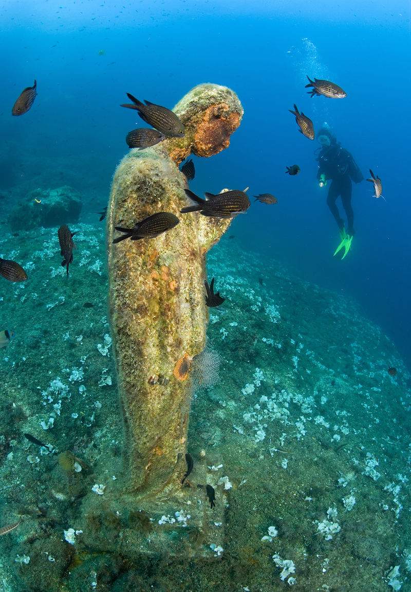
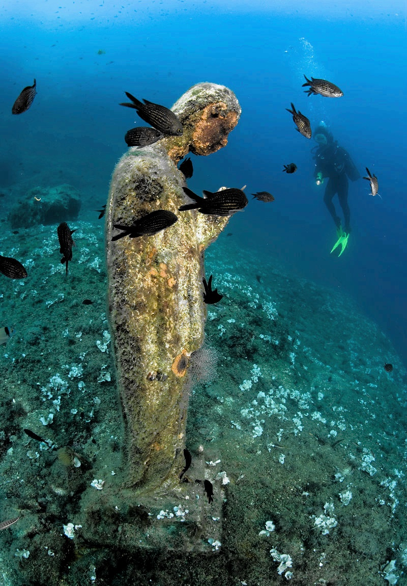
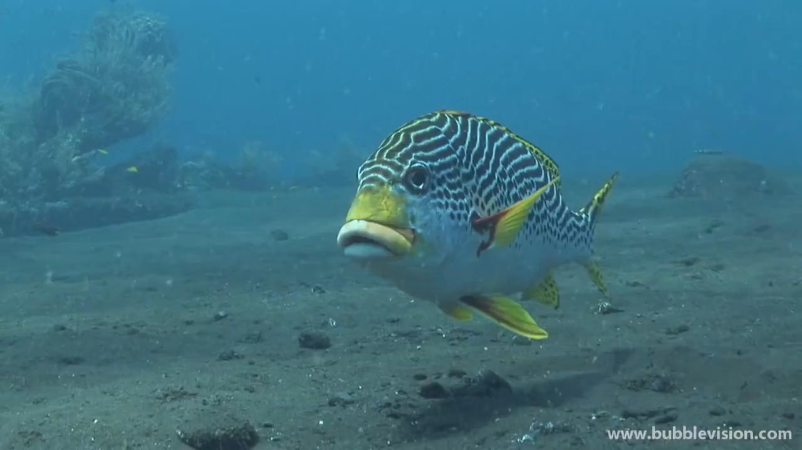
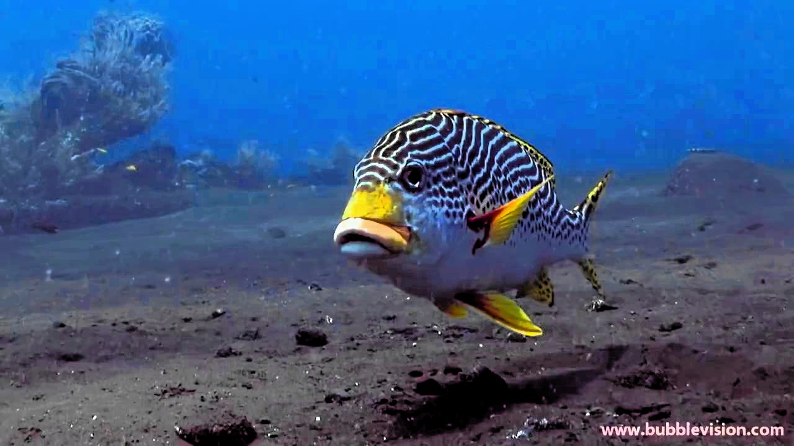

# 📊 Evaluation Results: DIRS-CLAHS Enhancement on UIEB (Challenging-60)

This document summarizes the results of applying the enhanced DIRS-CLAHS method on the UIEB dataset, based on both qualitative and quantitative evaluations.

---

## 1. Evaluation Metrics
| Metric       | Original | Enhanced |
|--------------|----------|----------|
| PSNR (dB)    | 18.52    | 26.75    |
| SSIM         | 0.61     | 0.87     |
| Entropy      | 5.12     | 7.45     |
| UIQM         | 1.85     | 3.92     |
| MSE          | 340.8    | 120.3    |

- **↑ PSNR/SSIM**: Better structural clarity and low distortion.
- **↑ Entropy/UIQM**: Enhanced detail and perceptual quality.
- **↓ MSE**: Reduced pixel-wise error.

---

## 2. Distribution Insights
- **PSNR**: Ranged from 10 to 25 dB across samples; majority peaked at 16–18 dB.
- **SSIM**: Most images fell between 0.7–0.85, indicating strong structure preservation.
- **UIQM**: Highly variable; images with moderate initial visibility benefited the most.

---

## 3. Visual Comparisons

| Original Image | Enhanced Image |
|----------------|----------------|
|  |  |
|  |  |

---

## 4. Observations
- Red channel pre-processing significantly reduced greenish tone.
- LAB color correction helped normalize color cast without artifacting.
- Pipeline worked especially well for moderately turbid images.

---

## 5. Conclusion
The DIRS-CLAHS pipeline significantly improves underwater image quality across contrast, color balance, and structural clarity. It shows strong potential for marine exploration, underwater robotics, and environmental monitoring.
